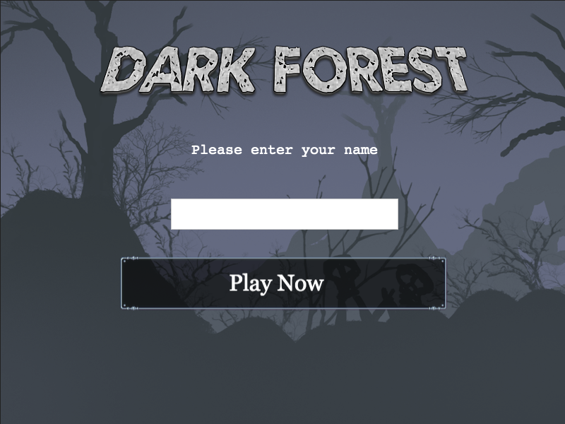
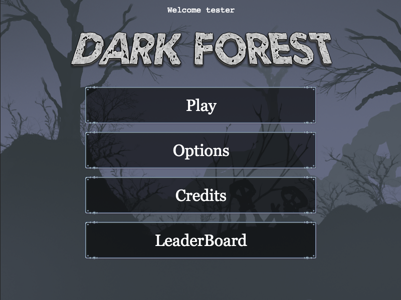
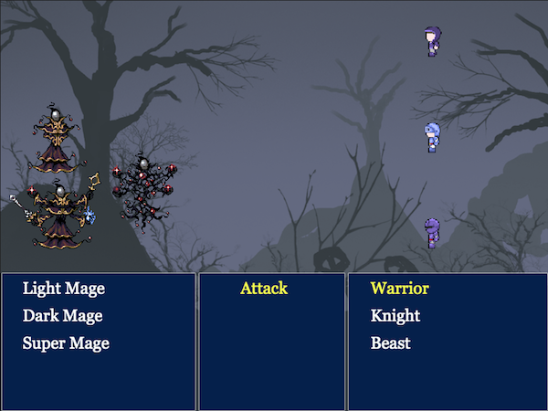
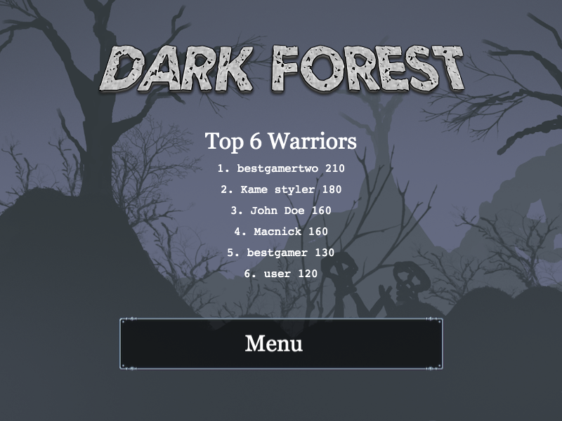

# JavaScript capstone project - RPG game

Building a turn-based RPG game using JavaScript and Phaser game engine

## Table of Contents

- [Objective](#Objective)
- [Story](#Story)
- [Gameplay](#Gameplay)
- [How to Play](#How-to-Play)
- [Technologies Used](#Technologies-Used)
- [Live Version](#Live-version)
- [Install and Run](#How-to-Install-and-Run-in-Your-Computer)
- [Acknowledgements](#Acknowlegements)

### Objective

The objective of this project is to build a simple turn-based RPG game with a scoring system, using JavaScript ES6, Phaser 3 framework, and other modern technologies. See [technologies used](#Technologies-Used) for more info. I had to design the story, the gameplay, the scenes, and the scoring system.

[Up](#Table-of-Contents)

### Story

You are the leader of a small team of warriors. You just received a communication from headquarters that the frontier town of Arcadia is about to be attacked by a horde of Orcs. You have to be there in 2 days to save the people of the town from the assault. If you take the safe road you will arrive in 7 days. That is too long and the town will be lost. The only chance to make it on time is to pass through the dangerous **Dark Forest**.

Passing the forest will be difficult and risky. It is known that various monsters and reprobates are larking in places waiting to attack any trespassers. Even you and your experienced fighters might not be able to accomplish that. The people of Arcadia are relying on you to save them. Do not fail your mission.

[Up](#Table-of-Contents)

### Gameplay

You control a character on the screen which represents your team. You start on the top left corner and you have to navigate through the map to find the exit of the forest.

You will get attacked by a varying number of different enemies during your journey. These are randomly chosen by the game.

When attacked you enter the battle screen where you decide which enemy to attack each time. This is a turn-based RPG so each of your team members attacks only once. The same applies to the enemies when you finish attacking. The battle continues until you defeat all foes or be defeated by them.

Do not worry about your health it is been restored to full after each battle.

If you reach the other end of the forest you are victorious and you can go on to Arcadia to save it from the orc attack. But this is another story...

[Up](#Table-of-Contents)

### How to Play

1. #### Start Screen

Enter you name or avatar in the first screen and click on 'Play Now' button.

Next screen is here you control the game. You have 4 options:

2. #### Play

Here is where the fun begins. By clicking 'Play' you are transferred to the forest. You move your character on the screen by using the four arrow keys. You can move up, down, left, right, and even diagonally if you keep to arrows pressed simultaneously.

- #### Battlefield

When attacked by foes you are transferred to the Battlefield. On the left side of the screen appear the attacking enemies. On the right side is your team. You, the Warrior, the Knight, and the Beast. Below them are three blue areas. The left area lists the names of the enemies, the right area the names of your team, and in the middle are the available commands. Currently, the only available command is 'Attack'.

Your team starts attacking first, one at a time. The attacker's name is in yellow letters. By pressing the up and down arrow you can select which foe to attack. After selecting press space to commence the attack.

If you kill all the enemies you return to the forest and you can proceed with your quest. If you lose all your team it is 'Game Over' and you are transferred to the 'Game Over' scene.

Your score is updated after each battle. If you get out of the forest you will see the 'Victory' scene and your score.

3. #### Options

'Music Enabled' checkbox controls whether you will have music during playing or not.

'Sound Enabled' button is not operational yet.

4. #### Credits

The credits for this game.

5. #### LeaderBoard

The six all-time best scores are listed on the LeaderBoard.

[Up](#Table-of-Contents)

### Technologies Used

- Node, npm
- Phaser 3
- JavaScript
- Webpack
- Babel
- Jest
- ESlint
- HTML/CSS
- Netlify
- Microverse Leaderboard API

[Up](#Table-of-Contents)

### Live version

The game is hosted on netlify.com You can play the game here: [**Dark Forest**](https://darkforest.netlify.app)

### How to Install and Run in Your Computer

To run the scripts **npm** is required. To get npm you have to install [Node.js](https://nodejs.org). Follow the installation instructions for your system Mac, Linux or Windows.

Use your terminal and run the commands after each instruction.

| Command                                             | Description                                           |
| --------------------------------------------------- | ----------------------------------------------------- |
| `git clone https://github.com/macnick/RPG-game.git` | Clone the repository to you computer                  |
| `cd RPG-game`                                       | Navigate to the newly created folder                  |
| `npm install`                                       | Install dependencies and launch browser with examples |
| `npm start`                                         | Makes the build and starts the development server     |
|                                                     | Press `Ctrl + c` to kill **http-server** process      |
| `http://localhost:8000`                             | Visit this link to play the game                      |

[Up](#Table-of-Contents)

## Acknowlegements

- Dark Forest Background image By Zeyu Ren 任泽宇
- Button and enemy images by pennomi, Buch, cemkalyoncu at [opengameart.org](https://opengameart.org/)
- Title image created using [textcraft.net](https://textcraft.net)
- Player images by [craftpix.net](https://craftpix.net/)

[Up](#Table-of-Contents)

## 👤 Author

- Github: [@macnick](https://github.com/macnick)
- Twitter: [@mac_experts](https://twitter.com/mac_experts)
- Linkedin: [Nick Haralampopoulos](https://www.linkedin.com/in/nick-haralampopoulos/)

## 🤝 Contributing

Contributions, issues and feature requests are welcome!

Feel free to check the [issues page](https://github.com/macnick/RPG-game/issues).

1. Fork it (https://github.com/macnick/RPG-game/fork)
2. Create your feature branch (git checkout -b my-new-feature)
3. Commit your changes (git commit -am 'Add some feature')
4. Push to the branch (git push origin my-new-feature)
5. Create a new Pull Request

## Show your support

Give a ⭐️ if you enjoyed this project!

## 📝 License

This project is [MIT](lic.url) licensed.
